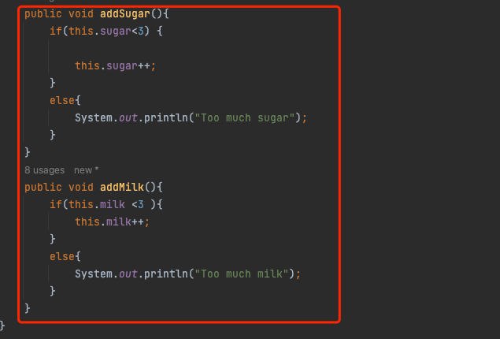

# HW6 
# Examine your code and identify opportunities for code improvement (10 points)
Change 1 :
I deleted the Tea class. Because nothing is done in the "Tea" Class. Correspondingly, I will directly inherit all the "Tea" classes from the "Drink" class.

old：


new:


Change 2 :
I merged the "CoffeeMachine" and "TeaMachine" classes into a "DrinkMachine" class. Because these two classes have duplicate functions, both are used to create drinks. So I merged the two classes and wrote the two functions into one class.

Old:


New:


Change 3 :
I set the original "sugar" and "milk" of "Coffee" to private, this is to prevent external operations from directly modifying the properties, and added the "Set" function to set that only numbers less than 3 and greater than 0 can be set operate. In addition, I also modified the "addSugar" and "addMilk" functions so that if they are greater than 3, they cannot be added.

New:




# Describe the changes made to the code (10 points)
Document the details of the changes and create a UML class diagram that illustrates the
implementation of the design pattern(s) used.


# HW1
# Task 1 : Implementation Description. (2 points )
• How flexible is your implementation, e.g., how you add or remove in future new drink types? 
    From my point of view, I make a "Drink"  as the main class and using "Coffee" and "Tea" to inherit the "Drink".If I have some new type of coffee that     I need add to my project. I can directly inhenrit from "Coffee". "Tea" does the same operation.
• How is the simplicity and understandability of your implementation?
    I think the comprehensibility of my code is very high
• How you avoided duplicated code?
    I used the inheritance method to avoid duplicated. I'm going to put the duplicate function or element inside the parent function
# Task 2 - UML Class Diagram. (5 points )


# Task 3 -Implement your solution in Java (13 points )
    git:https://github.com/metcs/met-cs665-assignment-1-HUZZZW.git

# Project Template

This is a Java Maven Project Template


# How to compile the project

We use Apache Maven to compile and run this project. 

You need to install Apache Maven (https://maven.apache.org/)  on your system. 

Type on the command line: 

```bash
mvn clean compile
```

# How to create a binary runnable package 


```bash
mvn clean compile assembly:single
```


# How to run

```bash
mvn -q clean compile exec:java -Dexec.executable="edu.bu.met.cs665.Main" -Dlog4j.configuration="file:log4j.properties"
```

# Run all the unit test classes.


```bash
mvn clean compile test checkstyle:check  spotbugs:check
```

# Using Spotbugs to find bugs in your project 

To see bug detail using the Findbugs GUI, use the following command "mvn findbugs:gui"

Or you can create a XML report by using  


```bash
mvn spotbugs:gui 
```

or 


```bash
mvn spotbugs:spotbugs
```


```bash
mvn spotbugs:check 
```

check goal runs analysis like spotbugs goal, and make the build failed if it found any bugs. 


For more info see 
https://spotbugs.readthedocs.io/en/latest/maven.html


SpotBugs https://spotbugs.github.io/ is the spiritual successor of FindBugs.


# Run Checkstyle 

CheckStyle code styling configuration files are in config/ directory. Maven checkstyle plugin is set to use google code style. 
You can change it to other styles like sun checkstyle. 

To analyze this example using CheckStyle run 

```bash
mvn checkstyle:check
```

This will generate a report in XML format


```bash
target/checkstyle-checker.xml
target/checkstyle-result.xml
```

and the following command will generate a report in HTML format that you can open it using a Web browser. 

```bash
mvn checkstyle:checkstyle
```

```bash
target/site/checkstyle.html
```


